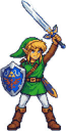
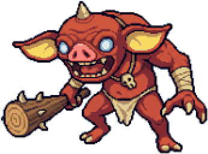
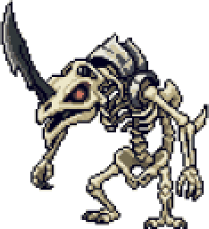

# Zelda-Link.cpp

  

> **How this was built (AI use):** all the C++ game code is written by me, by hand. This is not vibe coding. I discuss ideas with Claude, write the code myself, then ask Claude to review it and point out mistakes so I can learn from them. The exception is the tooling: `tools/autoplay.py`, `tools/autoplay_driver.cpp` (an automated test that plays the game and checks rules) and `check-memory.sh` were written with AI, to find bugs faster.

> **Disclaimer:** This is an unofficial fan project with no affiliation to Nintendo. *The Legend of Zelda* and its characters belong to Nintendo — this project is just inspired by them, built purely for personal learning and hobby purposes. No plan to publicly release or distribute this as a playable game — any cross-platform builds are purely to learn the packaging process itself.

A game-physics exploration in C++ and SDL2, built **from scratch with no game engine and no physics library**. The goal is to understand how movement, knockback and a Tears-of-the-Kingdom-style *recall* (replaying past positions in reverse) actually work under the hood, instead of relying on an engine that hides them. It doubles as a way to learn core C++: classes, inheritance, pointers and memory management.

Originally a terminal-only combat loop, now being migrated to **SDL2** for actual rendering, using SDL2's built-in renderer.

## How I work on this

Every mechanic goes through the same loop:

1. **Try my own way.** Write it by hand, with no engine to lean on.
2. **Find the bugs.** Play it, and let `tools/autoplay.py` play it too: it presses the keys, prints every state change and checks rules on every frame.
3. **Remove them.** Fix the cause, not the symptom.
4. **Ask if there is a simpler way**, one with fewer places to go wrong.

Example: the turn flow started as `currentState` plus many bools (`isKnocked`, `isKnocking`, `isReturn`, ...). It worked, but the bugs kept coming from those two disagreeing, for instance one shared `NONE` state that both the player and the enemy set and that only the enemy's check should have reacted to. The lesson is one state per actor instead of many bools, which is planned under Future work.

The core loop: a `Player` (Link) selects one of two `Weapon` objects and attacks one of two `Enemy` objects (`Bokobolin`, `Stalfos`) each turn, and enemies take their own turn back, cycling through living enemies and skipping dead ones, until either both enemies are defeated or Link runs out of health/durability.

**Current focus:** the physics and the turn flow (approach, knockback, recall) and making them robust. Next up: drawing it with SDL2.

## Concepts practiced

- **Classes & inheritance** — `Entity` as a base class, `Player`/`Enemy` as child classes.
- **Structs vs classes** — `EnemyStats` used to bundle constructor data instead of long parameter lists
- **Pointers & smart pointers** — `std::unique_ptr` for automatic memory cleanup, raw pointers (`Weapon*`, `Enemy*`) for non-owning references between objects
- **Stack vs heap** — explored directly with a debugger (breakpoints + memory inspector) to inspect actual object layout in memory
- **Input validation** — handling invalid choices, already-broken weapons, already-defeated enemies and `std::cin` failure states
- **Basic 2D physics** — direction vectors, normalization, distance checks for "has this entity arrived at its target"
- **Knockback and recall** — velocity with friction, and replaying stored positions in reverse to walk back to base
- **State machines** — turn flow as states, and what goes wrong when one state serves two sides or when bools and states disagree
- **Automated testing** — a script that plays the game headless and checks rules every frame
- **SDL2 fundamentals** — window/renderer setup, the event loop and why blocking the event loop (e.g. `SDL_Delay`) breaks rendering on macOS

## Build

```bash
clang++ -std=c++17 main.cpp weapon.cpp Enemy.cpp Entity.cpp Player.cpp \
  -I/opt/homebrew/include/SDL2 -D_THREAD_SAFE -L/opt/homebrew/lib -lSDL2main -lSDL2 -lSDL2_image -lSDL2_mixer -Wl,-framework,Cocoa \
  -o game
```

## Files

| File | Purpose |
|---|---|
| `main.cpp` | Game loop, SDL2 window setup, input handling, turn logic |
| `weapon.h/.cpp` | `Weapon` class — damage, durability, attack |
| `Entity.h/.cpp` | Base class of `Player` and `Enemy`: health, position/velocity, damage, and the knockback / recall physics (written once) |
| `Enemy.h/.cpp` | `Enemy`, built from `EnemyStats`; walks to the player and back |
| `Player.h/.cpp` | Player state, equipped weapon/target, and move-toward-target physics in `Attack()` |
| `CombatUtils.h` | Shared `ApplyDamage()` used by both `Enemy` and `Player` |
| `main-sdl.cpp` | Standalone SDL2 exploration file (window/renderer/event loop basics), separate from the actual game |
| `notes.txt` | Personal study notes (English/Malay mixed) — memory layout, pointers vs references, stack vs heap |
| `sdl-notes.txt` | Notes specifically on SDL2 fundamentals and V-Sync |
| `tools/autoplay.py`, `tools/autoplay_driver.cpp` | Plays the real game headless by injecting key presses, prints every state change and checks rules. This is how the bugs get found (written with AI) |
| `check-memory.sh` | Samples the running game's RAM once per second into `memory-log.csv` (written with AI) |
| `TODO.md` | Worklist |
| `assets/compressed/` | Cropped, palette-reduced character sprites (a few KB each) — the `*-2x.png` copies are what the README shows |
| `assets/*.mp4` | Intro and hit-animation clips (not rendered in-game yet) |
| `assets/*.jpeg` | Original 2048×2048 character art, kept as source for the compressed sprites |

## Limitations

- No visible rendering of Link or the enemies yet .SDL2 window and the actual combat logic are still separate; position/velocity data exists but isn't drawn to screen yet

## Future work

- Draw Link and the 2 enemies as actual sprites in the SDL2 window using the position data that already exists
- Use State Machine per Entity in Entity Class to minimize bug and compelexity of different bool combination as of now
- Sound effects for attacks
- An intro screen before the game starts
- Package builds for Windows, macOS, and Linux
- Move enemy/weapon stats into a data table instead of hardcoded constructor values, to scale past two enemy types without writing a new class per enemy
- Long-shot goal: get this running on a jailbroken Wii

## Status

Active learning project — the commit history intentionally shows real bugs found and fixed along the way rather than a single polished snapshot. Early ones: an infinite loop from unhandled `cin` failure, double-counted durability, missing damage guard on defeated enemies. Recent ones: a second knock corrupting the recall vector, enemies charging during the player's turn, and one shared state starting the enemy's turn early. Each fix is written up with its cause and location in the commit message.
