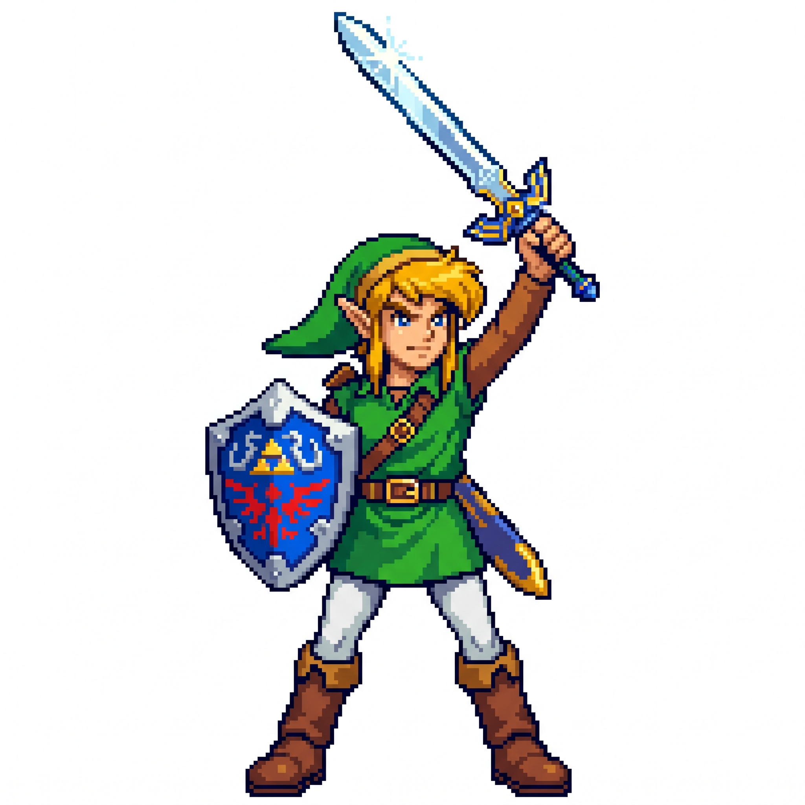

# Zelda-Link.cpp



> **Disclaimer:** This is an unofficial fan project with no affiliation to Nintendo. *The Legend of Zelda* and its characters belong to Nintendo — this project is just inspired by them, built purely for personal learning and hobby purposes. There is no plan to release, publish, or distribute this as a playable game anywhere.

A C++ program built for learning core language concepts — classes, inheritance, polymorphism, pointers, memory management and now basic physics through a working example instead of just theory.

Originally a terminal-only combat loop, now being migrated to **SDL2** for actual rendering. No Metal/Vulkan involved in this project — those are being explored separately; this one stays on SDL2's built-in renderer.

The core loop: a `Player` (Link) selects one of two `Weapon` objects and attacks one of two `Enemy` objects (`Bokobolin`, `Stalfos`) each turn, and enemies take their own turn back, cycling through living enemies and skipping dead ones, until either both enemies are defeated or Link runs out of health/durability.

**Current focus:** basic physics — position, velocity, and normalized direction vectors so `Player::Attack()` moves toward its target at a fixed speed instead of teleporting.

## Concepts practiced

- **Classes & inheritance** — `Enemy` as a base class, `Bokobolin`/`Stalfos` as derived classes overriding behavior with `virtual`/`override`
- **Structs vs classes** — `EnemyStats` used to bundle constructor data instead of long parameter lists
- **Pointers & smart pointers** — `std::unique_ptr` for automatic memory cleanup, raw pointers (`Weapon*`, `Enemy*`) for non-owning references between objects
- **Stack vs heap** — explored directly with a debugger (breakpoints + memory inspector) to inspect actual object layout in memory
- **Input validation** — handling invalid choices, already-broken weapons, already-defeated enemies and `std::cin` failure states
- **Basic 2D physics** — direction vectors, normalization, distance checks for "has this entity arrived at its target"
- **SDL2 fundamentals** — window/renderer setup, the event loop and why blocking the event loop (e.g. `SDL_Delay`) breaks rendering on macOS

## Build

```bash
clang++ -std=c++17 main.cpp weapon.cpp Enemy.cpp Bokobolin.cpp Stalfos.cpp Player.cpp \
  -I/opt/homebrew/include/SDL2 -D_THREAD_SAFE -L/opt/homebrew/lib -lSDL2main -lSDL2 -Wl,-framework,Cocoa \
  -o game
```

## Files

| File | Purpose |
|---|---|
| `main.cpp` | Game loop, SDL2 window setup, input handling, turn logic |
| `weapon.h/.cpp` | `Weapon` class — damage, durability, attack |
| `Enemy.h/.cpp` | Base `Enemy` class — health, damage, position/velocity, `TakeAction()` |
| `Bokobolin.h/.cpp`, `Stalfos.h/.cpp` | Enemy subclasses with their own stats and `TakeAction()` override |
| `Player.h/.cpp` | Player state, equipped weapon/target, and move-toward-target physics in `Attack()` |
| `CombatUtils.h` | Shared `ApplyDamage()` used by both `Enemy` and `Player` |
| `main-sdl.cpp` | Standalone SDL2 exploration file (window/renderer/event loop basics), separate from the actual game |
| `notes.txt` | Personal study notes (English/Malay mixed) — memory layout, pointers vs references, stack vs heap |
| `sdl-notes.txt` | Notes specifically on SDL2 fundamentals and V-Sync |
| `assets/link.jpeg` | README banner image |

## Limitations

- No visible rendering of Link or the enemies yet .SDL2 window and the actual combat logic are still separate; position/velocity data exists but isn't drawn to screen yet
- `Enemy`'s base class has a `virtual` function but no virtual destructor (known gap, kept as-is intentionally while still learning the implications)

## Future work

- Draw Link and the 2 enemies as actual sprites in the SDL2 window using the position data that already exists
- Sound effects for attacks
- An intro screen before the game starts
- Package builds for Windows, macOS, and Linux
- Move enemy/weapon stats into a data table instead of hardcoded constructor values, to scale past two enemy types without writing a new class per enemy
- Add a proper virtual destructor once polymorphic ownership (e.g. a shared `Enemy*` container) is introduced
- Long-shot goal: get this running on a jailbroken Wii

## Status

Active learning project — the commit history intentionally shows real bugs found and fixed along the way (an infinite loop from unhandled `cin` failure, double-counted durability, missing damage guard on defeated enemies, constructor argument mismatches while adding physics) rather than a single polished snapshot.
