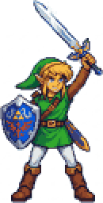
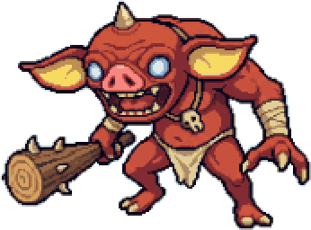
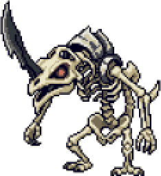

# Zelda-Link.cpp

  

> **How this was built (AI use):** the mechanics and the physics (turns, movement, knockback, the recall replay, levels, the state machines) are written by me, by hand. This is not vibe coding: I discuss an idea with Claude, then write it myself until I understand it, and ask Claude to review it and point out mistakes so I can learn from them. The exceptions, written mostly with AI to move faster: the SDL2 code in `src/sdl/` (text with a built-in pixel font, health bars and prompts, the intro and cutscene player, the screen layout, the gamepad input) and the tooling: `tools/autoplay.py`, `tools/autoplay_driver.cpp` (an automated test that plays the game and checks rules), `tools/extract_frames.sh` and `check-memory.sh`.

> **Disclaimer:** This is an unofficial fan project with no affiliation to Nintendo. *The Legend of Zelda* and its characters belong to Nintendo — this project is just inspired by them, built purely for personal learning and hobby purposes. No plan to publicly release or distribute this as a playable game — any cross-platform builds are purely to learn the packaging process itself.

A turn-based Zelda duel inspired by the *Recall* ability in *Tears of the Kingdom* and by Zelda's story, built as a way to learn C++.

A game-physics exploration in C++ and SDL2, built **from scratch with no game engine and no physics library**. The goal is to understand how movement, knockback and a Tears-of-the-Kingdom-style *recall* (replaying past positions in reverse) actually work under the hood, instead of relying on an engine that hides them. It doubles as a way to learn core C++: classes, inheritance, pointers and memory management.

Renders with SDL2: sprites, background music, vsync, text and health bars, an intro and hit cutscenes.

## How I work on this

Every mechanic goes through the same loop:

1. **Try my own way.** Write it by hand, with no engine to lean on.
2. **Find the bugs.** Play it, and let `tools/autoplay.py` play it too: it presses the keys, prints every state change and checks rules on every frame.
3. **Remove them.** Fix the cause, not the symptom.
4. **Ask if there is a simpler way**, one with fewer places to go wrong.

Example: the turn flow started as `currentState` plus many bools (`isKnocked`, `isKnocking`, `isReturn`, ...). It worked, but the bugs kept coming from those two disagreeing, for instance one shared state that both the player and the enemy set and that only the enemy's check should have reacted to. The fix was one state per actor (`Entity::GameState`) instead of many bools shared across sides, so each entity's state can only ever be one thing at a time.

The core loop: a `Player` (Link) selects one of two `Weapon` objects and attacks one of two `Enemy` objects (`Bokobolin`, `Stalfos`) each turn, and enemies take their own turn back, cycling through living enemies and skipping dead ones, until either both enemies are defeated or Link runs out of health/durability. There are 3 levels; the same two enemy types return each level with higher stats, built from one data table instead of separate hand-written variables per level.

**Current focus:** mechanics have to satisfy me before animation or other polish get added, so the intro, text and hit cutscenes only came once they did. Movement and the recall replay are both frame-rate independent (speed × time instead of a fixed amount per frame; the recall plays back by elapsed seconds). Next physics step: real overlap-based collision.

## Concepts practiced

- **Classes & inheritance** — `Entity` as a base class, `Player`/`Enemy` as child classes.
- **Structs vs classes** — `EnemyStats` used to bundle constructor data instead of long parameter lists
- **Pointers & smart pointers** — `std::unique_ptr` for automatic memory cleanup, raw pointers for non-owning references between objects
- **Move semantics & ownership** — `levelEnemies` owns each enemy directly as a `unique_ptr`; learned the hard way that brace-initializing a container of a move-only type tries to copy it (`std::initializer_list` only ever gives const access), so it has to be built with `push_back` and moved in with `std::move`
- **Stack vs heap** — explored directly with a debugger (breakpoints + memory inspector) to inspect actual object layout in memory; also where an object actually lives when it's owned by a `unique_ptr` versus a variable's own scope
- **Basic 2D physics** — direction vectors, normalization, distance checks for "has this entity arrived at its target"
- **Knockback and recall** — velocity with friction, and replaying stored positions in reverse to walk back to base
- **State machines** — one `currentState` per entity instead of scattered bools; each side (player, enemy) checks and transitions its own state independently
- **Data-driven design** — enemy stats per level live in one `LevelStats` table instead of a hand-written variable per level/enemy pair
- **Frame-rate independence** — `Attack()`/`UpdateKnock()` moved from a fixed amount per frame to speed × `deltaTime`, and the recall replay stores a timestamp with every position and plays back by elapsed seconds, blending between the two nearest positions (checked with the autoplay script at 40 / 120 fps and unthrottled); learned the hard way that a stop-threshold has to compare a stable speed, not a displacement that shrinks with `deltaTime`, and that a one-shot state transition has to actually leave its own state, or it silently re-fires every single frame instead of once
- **Automated testing** — a script that plays the game headless and checks rules every frame; running it unthrottled (tens of thousands of frames a second) is what actually surfaced the bugs above, they were far too fast to catch by eye
- **SDL2 fundamentals** — window/renderer setup, sprite drawing, background music, the event loop and why blocking it (e.g. `SDL_Delay`) breaks rendering on macOS

## Build

```bash
clang++ -std=c++17 $(find src -name '*.cpp') -Isrc -Isrc/entities -Isrc/sdl \
  -I/opt/homebrew/include/SDL2 -D_THREAD_SAFE -L/opt/homebrew/lib -lSDL2main -lSDL2 -lSDL2_image -lSDL2_mixer -Wl,-framework,Cocoa \
  -o game
```

The game runs silently if `assets/audio/` isn't present locally — the background music file is gitignored (copyrighted).

The intro and the hit cutscenes are the `assets/*.mp4` clips, turned into numbered pictures plus their sound (`audio.ogg`) in `assets/frames/` by `tools/extract_frames.sh` (needs `ffmpeg`; SDL2 cannot play video). The background music pauses while a clip's sound plays. Without that folder the game still runs and just skips them.

## Controls

| | Keyboard | DualSense |
|---|---|---|
| Start the game (after the intro) | Enter | X |
| Choose the first option (weapon, target) | 1 | X |
| Choose the second option | 2 | O |

The on-screen prompts show whichever you used last (`[1]` / `[2]` or `[X]` / `[O]`).

## Files

All game code is in `src/`: `main.cpp` and the small shared headers sit at the top, the actors (`Entity`, `Player`, `Enemy`, `Weapon`) in `src/entities/`, and everything that draws with SDL2 (`ui`, `clip`, `screens`) in `src/sdl/`. The file names below leave out the folder, and they are relative to `src/` unless they start with `tools/`, `assets/` or say otherwise.

| File | Purpose |
|---|---|
| `main.cpp` | Game loop, SDL2 window/sprite/music setup, input handling, turn logic, level progression |
| `weapon.h/.cpp` | `Weapon` class — damage, durability, attack |
| `Entity.h/.cpp` | Base class of `Player` and `Enemy`: health, position/velocity, per-entity state, damage, attack movement, and the knockback / recall physics (written once, shared by both) |
| `Enemy.h/.cpp` | `Enemy`, built from `EnemyStats` |
| `Player.h/.cpp` | Player-only state: equipped weapon, target enemy |
| `CombatUtils.h` | Shared `ApplyDamage()` used by both `Enemy` and `Player` |
| `ui.h/.cpp` | Text, health labels, the prompt bar and the game-over overlay, drawn with a small built-in 5×7 pixel font (no SDL_ttf, no font file) |
| `clip.h/.cpp` | `Clip`: plays an animation stored as numbered pictures, picking the picture by elapsed seconds so it takes the same time at any frame rate, and plays the clip's sound with it (the music pauses meanwhile) |
| `screens.h/.cpp` | `DrawScreens()`: draws a whole frame from one function: sprites, health labels, the prompts for each game state, the intro, the cutscenes, game over / you win |
| `input.h/.cpp` | Gamepad input: a DualSense button is turned into the key press the game already understands (X = Enter in the intro and 1 in the menus, O = 2), and the prompts follow whichever the player used last |
| `GameState.h`, `levels.h` | The big game phases (`enum GameState`) and the `LevelStats` table with each level's enemy stats, both moved out of `main.cpp` |
| `main-sdl.cpp` (repo root) | Standalone SDL2 exploration file (window/renderer/event loop basics), separate from the actual game |
| `notes.txt` | Personal study notes (English/Malay mixed) — memory layout, pointers vs references, stack vs heap |
| `sdl-notes.txt` | Notes specifically on SDL2 fundamentals and V-Sync |
| `tools/autoplay.py`, `tools/autoplay_driver.cpp` | Plays the real game headless by injecting key presses, prints every state change and checks rules. This is how the bugs get found (written with AI) |
| `tools/extract_frames.sh` | Turns `assets/*.mp4` into numbered JPEGs and an `audio.ogg` in `assets/frames/` for the intro and cutscenes |
| `check-memory.sh` | Samples the running game's RAM once per second into `memory-log.csv` (written with AI) |
| `TODO.md` | Worklist |
| `assets/compressed/` | Cropped, palette-reduced character sprites (a few KB each) — the `*-2x.png` copies are what the README shows |
| `assets/*.mp4` | Intro and hit-animation clips (the source for `assets/frames/`) |
| `assets/frames/` | The clips as numbered JPEGs, 12 per second, plus each clip's sound as `audio.ogg` (about 6 MB in all) |
| `assets/*.jpeg` | Original 2048×2048 character art, kept as source for the compressed sprites |
| `assets/audio/` | Background music, local-only, gitignored (copyrighted) |

## Future work

- Real overlap-based collision
- Package builds for Windows, macOS, and Linux
- Long-shot goals: get this running on a jailbroken Wii and a jailbroken PS5

## Status

Active learning project — the commit history intentionally shows real bugs found and fixed along the way rather than a single polished snapshot. A few of the more notable ones:

1. An infinite loop from an unhandled `cin` failure (early version, before SDL2)
2. A shared state both the player and the enemy set, letting the enemy's turn start early
3. A null pointer dereference from checking the wrong side's target during the enemy's turn
4. A per-entity state refactor that quietly broke an outer state's one-shot assumption, letting an enemy's turn re-trigger every frame instead of once
5. A recall state that meant two different things depending on context, and crashed when both meanings collided in the same frame
6. `Return()` deciding "arrived home" by exact float equality, which a decayed walk-back almost never lands on exactly

Each fix is written up with its cause and location in the commit message.
